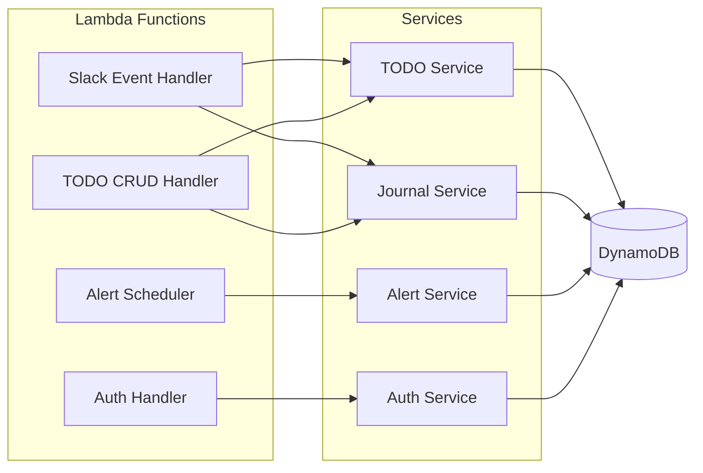
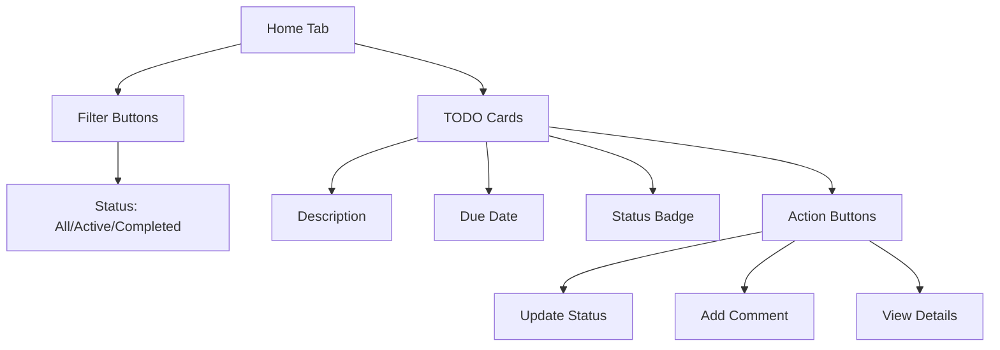
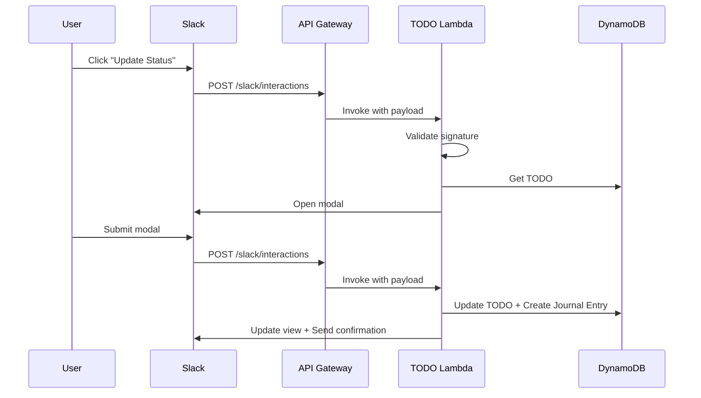
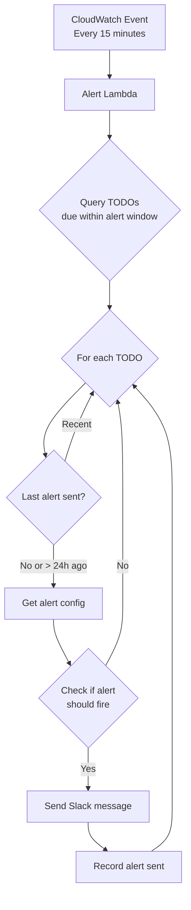
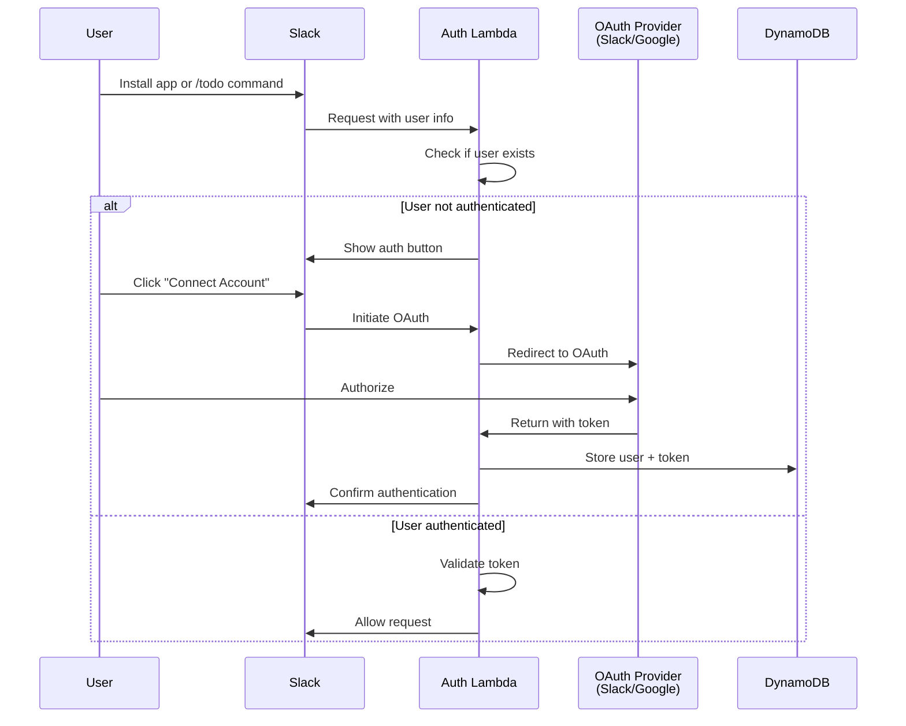
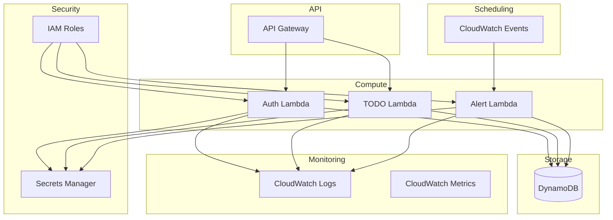

# TODO List Application - Design Proposal

## Executive Summary

This document outlines the design for a Slack-based TODO list application that allows users to manage tasks with journaling capabilities, automated alerts, and seamless authentication. The system is designed for micro-scale deployment (1-50 users) using AWS free tier resources.

## Table of Contents

1. [System Overview](#system-overview)
2. [Requirements](#requirements)
3. [Architecture](#architecture)
4. [Data Models](#data-models)
5. [Slack Integration](#slack-integration)
6. [Alert System](#alert-system)
7. [Authentication](#authentication)
8. [AWS Infrastructure](#aws-infrastructure)
9. [Technology Stack](#technology-stack)
10. [Implementation Plan](#implementation-plan)
11. [Cost Estimation](#cost-estimation)

## System Overview

The TODO list application is a serverless, Slack-native task management system that provides:
- Full CRUD operations on TODO items via Slack
- Rich task metadata including status tracking and journaling
- Automated alerts for approaching deadlines
- OAuth-based authentication (Slack/Google)
- Visual GUI and CLI interface within Slack

### Key Design Principles

1. **Serverless-First**: Leverage AWS Lambda and managed services to stay within free tier
2. **Slack-Native**: All interactions through Slack (no separate UI to maintain)
3. **Micro-Scale Optimized**: Simple architecture suitable for 1-50 users
4. **Familiar Technologies**: TypeScript for business logic, Terraform for infrastructure

## Requirements

### Functional Requirements

- ✅ CRUD operations for TODO items
- ✅ TODO attributes: description, target completion date, status
- ✅ Journal of status changes and comments
- ✅ Comments can be standalone or associated with status changes
- ✅ All interactions via Slack
- ✅ Visual GUI in Slack (using Block Kit)
- ✅ Slack CLI commands
- ✅ Automated alerts for approaching deadlines
- ✅ Configurable alerting (global + per-TODO overrides)
- ✅ OAuth authentication (Slack or Google)

### Technical Requirements

- ✅ Support 1-50 users
- ✅ Use TypeScript/JavaScript for custom code
- ✅ Deploy on AWS free tier
- ✅ Infrastructure as Code using Terraform
- ✅ Easy code review and maintenance

## Architecture

### High-Level Architecture

```mermaid
graph TB
    subgraph "Slack"
        UI[Slack Client]
        CMD[Slash Commands]
        INT[Interactive Components]
    end
    
    subgraph "AWS"
        subgraph "API Layer"
            APIGW[API Gateway]
        end
        
        subgraph "Application Layer"
            AUTH[Auth Lambda<br/>TypeScript]
            TODO[TODO Lambda<br/>TypeScript]
            ALERT[Alert Lambda<br/>TypeScript]
        end
        
        subgraph "Data Layer"
            DDB[(DynamoDB)]
        end
        
        subgraph "Scheduling"
            CW[CloudWatch Events]
        end
    end
    
    subgraph "External Auth"
        SAUTH[Slack OAuth]
        GAUTH[Google OAuth]
    end
    
    UI --> APIGW
    CMD --> APIGW
    INT --> APIGW
    
    APIGW --> AUTH
    APIGW --> TODO
    
    AUTH --> SAUTH
    AUTH --> GAUTH
    AUTH --> DDB
    
    TODO --> DDB
    
    CW --> ALERT
    ALERT --> DDB
    ALERT --> UI
    
    style AWS fill:#FF9900,stroke:#232F3E,stroke-width:2px
    style Slack fill:#4A154B,stroke:#4A154B,stroke-width:2px
```



### Component Architecture



## Data Models

### DynamoDB Table Design

Single-table design optimized for access patterns:

```mermaid
erDiagram
    TODO {
        string PK "USER#userId"
        string SK "TODO#todoId"
        string description
        string status
        date targetDate
        json alertConfig
        timestamp createdAt
        timestamp updatedAt
    }
    
    JOURNAL_ENTRY {
        string PK "TODO#todoId"
        string SK "JOURNAL#timestamp"
        string type "STATUS_CHANGE|COMMENT"
        string content
        string userId
        string oldStatus
        string newStatus
        timestamp createdAt
    }
    
    USER {
        string PK "USER#userId"
        string SK "PROFILE"
        string slackId
        string email
        string authProvider
        json alertConfig
        timestamp createdAt
    }
    
    ALERT_CONFIG {
        string PK "CONFIG"
        string SK "GLOBAL_ALERTS"
        number daysBeforeDue
        json alertTimes
    }
```

### Entity Schemas

#### TODO Item
```typescript
interface TodoItem {
  id: string;
  userId: string;
  description: string;
  status: TodoStatus;
  targetDate: Date;
  alertConfig?: AlertConfig;
  createdAt: Date;
  updatedAt: Date;
}

enum TodoStatus {
  NOT_STARTED = "not_started",
  IN_PROGRESS = "in_progress",
  BLOCKED = "blocked",
  COMPLETED = "completed",
  CANCELLED = "cancelled"
}
```

#### Journal Entry
```typescript
interface JournalEntry {
  id: string;
  todoId: string;
  type: "status_change" | "comment";
  content: string;
  userId: string;
  oldStatus?: TodoStatus;
  newStatus?: TodoStatus;
  createdAt: Date;
}
```

#### Alert Configuration
```typescript
interface AlertConfig {
  enabled: boolean;
  daysBeforeDue: number[];  // e.g., [7, 3, 1] for weekly, 3-day, 1-day alerts
  alertTimes?: string[];     // e.g., ["09:00", "14:00"] for specific times
}
```

### Access Patterns

| Access Pattern | PK | SK | Index |
|---------------|----|----|-------|
| Get all TODOs for user | USER#userId | begins_with(TODO#) | - |
| Get specific TODO | TODO#todoId | TODO#todoId | GSI1 |
| Get journal for TODO | TODO#todoId | begins_with(JOURNAL#) | GSI1 |
| Get user profile | USER#userId | PROFILE | - |
| Get TODOs by status | USER#userId | begins_with(TODO#) | Filter |
| Get TODOs due soon | - | - | GSI2 (by targetDate) |

## Slack Integration

### Slack App Configuration

The Slack app requires the following scopes:

**Bot Token Scopes:**
- `chat:write` - Send messages
- `commands` - Handle slash commands
- `users:read` - Read user information
- `users:read.email` - Read user email for auth

**Event Subscriptions:**
- `message.im` - Direct messages (optional for natural language)

### Slack CLI Commands

```
/todo list [status]
  List all TODOs, optionally filtered by status
  
/todo create <description> --due <date>
  Create a new TODO item
  
/todo update <id> --status <status> --comment <text>
  Update TODO status and optionally add a comment
  
/todo comment <id> <text>
  Add a standalone comment to a TODO
  
/todo show <id>
  Show detailed view of a TODO including journal
  
/todo delete <id>
  Delete a TODO item
  
/todo config alerts --days <7,3,1> --times <09:00,17:00>
  Configure global alert settings
```

### Slack GUI (Block Kit)

#### TODO List View



Example Block Kit structure:
```typescript
{
  "type": "home",
  "blocks": [
    {
      "type": "section",
      "text": {
        "type": "mrkdwn",
        "text": "*My TODOs* 📝"
      },
      "accessory": {
        "type": "button",
        "text": {
          "type": "plain_text",
          "text": "Create TODO"
        },
        "action_id": "create_todo"
      }
    },
    {
      "type": "actions",
      "elements": [
        {
          "type": "button",
          "text": { "type": "plain_text", "text": "All" },
          "action_id": "filter_all"
        },
        {
          "type": "button",
          "text": { "type": "plain_text", "text": "Active" },
          "action_id": "filter_active"
        },
        {
          "type": "button",
          "text": { "type": "plain_text", "text": "Completed" },
          "action_id": "filter_completed"
        }
      ]
    },
    // TODO cards...
  ]
}
```

#### TODO Detail Modal

When clicking on a TODO, show a modal with:
- Full description
- Current status with dropdown to update
- Target date with date picker
- Journal entries (timeline view)
- Action buttons (Update, Comment, Delete)

```typescript
{
  "type": "modal",
  "title": {
    "type": "plain_text",
    "text": "TODO Details"
  },
  "blocks": [
    {
      "type": "section",
      "text": {
        "type": "mrkdwn",
        "text": "*Description:*\n{description}"
      }
    },
    {
      "type": "input",
      "label": {
        "type": "plain_text",
        "text": "Status"
      },
      "element": {
        "type": "static_select",
        "action_id": "status_select",
        "options": [...]
      }
    },
    {
      "type": "section",
      "text": {
        "type": "mrkdwn",
        "text": "*Journal:*"
      }
    },
    // Journal entries as context blocks
  ]
}
```

### Interactive Component Handling

Flow for interactive components:



## Alert System

### Alert Logic



### Alert Configuration Priority

1. **Per-TODO Config** (if set): Overrides global settings
2. **Global User Config**: User's default alert settings
3. **System Default**: 7, 3, 1 days before due date at 09:00

### Alert Message Format

```typescript
{
  "channel": "@user",
  "blocks": [
    {
      "type": "section",
      "text": {
        "type": "mrkdwn",
        "text": "⚠️ *TODO Alert*\n\n*{description}*\n\nDue: {targetDate} ({daysRemaining} days remaining)\nStatus: {status}"
      }
    },
    {
      "type": "actions",
      "elements": [
        {
          "type": "button",
          "text": { "type": "plain_text", "text": "View Details" },
          "action_id": "view_todo",
          "value": "{todoId}"
        },
        {
          "type": "button",
          "text": { "type": "plain_text", "text": "Mark Complete" },
          "action_id": "complete_todo",
          "value": "{todoId}"
        },
        {
          "type": "button",
          "text": { "type": "plain_text", "text": "Snooze" },
          "action_id": "snooze_alert",
          "value": "{todoId}"
        }
      ]
    }
  ]
}
```

## Authentication

### Authentication Flow



### Authentication Strategy

**Primary: Slack OAuth**
- Simplest for Slack-native app
- Users automatically authenticated via Slack workspace
- No additional login required
- Slack user ID as primary identifier

**Secondary: Google OAuth (Optional)**
- For additional security/verification
- Link Google account to Slack identity
- Useful for shared workspace scenarios
- Store mapping in DynamoDB

### Token Storage

```typescript
interface UserAuth {
  userId: string;
  slackId: string;
  slackToken?: string;
  googleId?: string;
  googleToken?: string;
  email: string;
  authProvider: "slack" | "google";
  tokenExpiry: Date;
  refreshToken?: string;
  createdAt: Date;
  updatedAt: Date;
}
```

### Session Management

- Use Slack's native user context for session management
- No separate session cookies required
- JWT tokens for API authentication (if direct API access needed)
- Token refresh handled automatically

## AWS Infrastructure

### Infrastructure Components



### AWS Free Tier Utilization

| Service | Free Tier | Expected Usage | Status |
|---------|-----------|----------------|--------|
| Lambda | 1M requests/month, 400,000 GB-seconds | ~50K requests/month | ✅ Well within |
| API Gateway | 1M calls/month (first 12 months) | ~50K calls/month | ✅ Within |
| DynamoDB | 25 GB storage, 25 RCU, 25 WCU | <1 GB, <10 RCU/WCU | ✅ Well within |
| CloudWatch Logs | 5 GB ingestion, 5 GB storage | <1 GB | ✅ Within |
| CloudWatch Events | 1M events/month (always free) | ~3K events/month | ✅ Well within |
| Secrets Manager | 30-day free trial, then $0.40/secret/month | 2 secrets | ⚠️ Minimal cost |

**Total Expected Monthly Cost**: ~$0.80 (2 secrets in Secrets Manager)

### Resource Sizing

**Lambda Functions:**
- Memory: 256 MB (sufficient for TypeScript runtime)
- Timeout: 30 seconds (API) / 5 minutes (Alert)
- Concurrency: No reserved capacity needed

**DynamoDB:**
- On-Demand pricing mode (no capacity planning)
- Expected: <1 GB data, <100 read/write per day
- Well within free tier

**API Gateway:**
- REST API (simpler than HTTP API for this use case)
- Regional endpoint
- No caching required

## Technology Stack

### Backend

**Runtime:**
- Node.js 20.x (AWS Lambda)
- TypeScript 5.x (compiled to JavaScript)

**Key Libraries:**
```json
{
  "@slack/bolt": "^3.x",           // Slack app framework
  "@slack/web-api": "^6.x",        // Slack API client
  "aws-sdk": "^2.x",                // AWS SDK
  "@aws-sdk/client-dynamodb": "^3.x", // DynamoDB client
  "@aws-sdk/lib-dynamodb": "^3.x",   // DynamoDB document client
  "jsonwebtoken": "^9.x",           // JWT handling
  "date-fns": "^2.x",               // Date utilities
  "zod": "^3.x"                     // Schema validation
}
```

### Infrastructure

**Terraform:**
- Version: 1.5+
- AWS Provider: 5.x

**Terraform Modules:**
```
terraform/
├── modules/
│   ├── lambda/           # Reusable Lambda module
│   ├── dynamodb/         # DynamoDB table module
│   ├── api-gateway/      # API Gateway module
│   └── iam/              # IAM roles and policies
├── environments/
│   ├── dev/
│   └── prod/
├── main.tf
├── variables.tf
├── outputs.tf
└── versions.tf
```

### Development Tools

- **Package Manager**: npm or pnpm
- **Testing**: Jest for unit tests
- **Linting**: ESLint with TypeScript plugin
- **Formatting**: Prettier
- **Build**: TypeScript compiler (tsc) + esbuild for bundling

## Implementation Plan

### Phase 1: Foundation (Week 1)

1. **Infrastructure Setup**
   - Initialize Terraform configuration
   - Set up DynamoDB table with GSIs
   - Configure API Gateway
   - Set up CloudWatch Logs

2. **Project Scaffolding**
   - Initialize TypeScript project
   - Set up build and test configuration
   - Define data models and types
   - Create shared utilities

### Phase 2: Core TODO Functionality (Week 2)

1. **TODO Service**
   - Implement CRUD operations
   - Add DynamoDB access layer
   - Create journal entry service
   - Write unit tests

2. **Slack CLI Commands**
   - Implement slash command handlers
   - Add command parsing and validation
   - Wire up to TODO service
   - Test with Slack app

### Phase 3: Slack GUI (Week 3)

1. **Home Tab**
   - Design Block Kit layouts
   - Implement TODO list view
   - Add filter functionality
   - Handle pagination

2. **Interactive Components**
   - Create TODO detail modal
   - Implement status update flow
   - Add comment functionality
   - Handle form submissions

### Phase 4: Alert System (Week 4)

1. **Alert Service**
   - Implement alert calculation logic
   - Create CloudWatch Event rule
   - Build alert Lambda function
   - Add configuration management

2. **Alert Delivery**
   - Format Slack alert messages
   - Implement snooze functionality
   - Add alert tracking
   - Test alert scenarios

### Phase 5: Authentication (Week 5)

1. **Slack OAuth**
   - Set up OAuth flow
   - Implement token storage
   - Add session validation
   - Test authentication

2. **Google OAuth (Optional)**
   - Set up Google OAuth
   - Implement account linking
   - Add to user settings
   - Test integration

### Phase 6: Testing & Polish (Week 6)

1. **Integration Testing**
   - End-to-end test scenarios
   - Load testing (simulate 50 users)
   - Error handling verification
   - Security audit

2. **Documentation**
   - Deployment guide
   - User guide
   - API documentation
   - Runbook for operations

### Deployment Steps

```bash
# 1. Build application
npm run build

# 2. Deploy infrastructure
cd terraform
terraform init
terraform plan
terraform apply

# 3. Deploy Lambda functions
npm run deploy

# 4. Configure Slack app
# - Set up app in Slack App Management
# - Configure OAuth redirect URLs
# - Set up slash commands
# - Configure event subscriptions
# - Install to workspace

# 5. Test
npm run test:integration

# 6. Monitor
# - Check CloudWatch Logs
# - Verify alerts firing
# - Test with real users
```

## Cost Estimation

### Monthly Cost Breakdown (50 users, moderate usage)

| Service | Usage | Cost |
|---------|-------|------|
| Lambda | 50K invocations, 12.5K GB-seconds | $0.00 (free tier) |
| API Gateway | 50K requests | $0.00 (free tier, first 12 months) |
| DynamoDB | 5 GB storage, on-demand | $0.00 (free tier) |
| CloudWatch Logs | 2 GB ingestion | $0.00 (free tier) |
| CloudWatch Events | 3K events | $0.00 (always free) |
| Secrets Manager | 2 secrets | $0.80 |
| **Total** | | **$0.80/month** |

**After 12 months** (when API Gateway free tier expires):
- API Gateway: 50K requests × $3.50/million = $0.18
- **Total: ~$1.00/month**

### Cost Optimization Tips

1. **Use DynamoDB on-demand pricing**: No charges when idle
2. **Set Lambda memory appropriately**: 256 MB is sufficient, cheaper than default
3. **Use CloudWatch Logs retention**: Set to 7 days to reduce storage
4. **Consider Parameter Store**: Free alternative to Secrets Manager (10K parameters free)
5. **Enable API Gateway caching**: Not needed for this scale, avoid extra cost

## Security Considerations

### Data Protection

- **Encryption at rest**: DynamoDB encryption enabled by default
- **Encryption in transit**: HTTPS/TLS for all API calls
- **Secrets management**: Store Slack/OAuth tokens in Secrets Manager
- **IAM principle of least privilege**: Each Lambda has minimal required permissions

### Authentication & Authorization

- **OAuth 2.0**: Industry standard for authentication
- **Token validation**: Verify Slack signatures on all requests
- **User isolation**: Partition key based on user ID prevents cross-user access
- **Session management**: Short-lived tokens, automatic refresh

### Slack Security

- **Request verification**: Validate Slack signing secret
- **SSL-only endpoints**: API Gateway with HTTPS only
- **Scope limitation**: Request minimum necessary Slack scopes
- **Rate limiting**: API Gateway throttling (10 requests/second per user)

### Monitoring & Alerts

- **CloudWatch alarms**: Alert on Lambda errors, DynamoDB throttles
- **Log all access**: CloudWatch Logs for audit trail
- **Anomaly detection**: CloudWatch Insights for unusual patterns
- **Error tracking**: Structured logging with correlation IDs

## Future Enhancements

### Phase 2 Features (Post-MVP)

1. **Recurring TODOs**
   - Support for repeated tasks
   - Template-based TODO creation

2. **Team Features**
   - Shared TODOs
   - Assignment to team members
   - Team workspaces

3. **Advanced Filtering**
   - Search by keywords
   - Complex filters (date ranges, multiple statuses)
   - Saved filters/views

4. **Integrations**
   - Calendar integration (Google Calendar, Outlook)
   - Export to CSV/JSON
   - Webhook notifications

5. **Analytics**
   - Completion rate dashboard
   - Time-to-complete metrics
   - Trend analysis

6. **Mobile Notifications**
   - Push notifications via Slack mobile app
   - SMS alerts (optional)

### Scalability Path

If user base grows beyond 50 users:

1. **100-500 users**:
   - Add DynamoDB auto-scaling
   - Implement Lambda provisioned concurrency
   - Add CloudFront for API caching

2. **500+ users**:
   - Consider Aurora Serverless for relational queries
   - Implement separate read replicas
   - Add ElastiCache for caching layer
   - Move to containerized architecture (ECS/EKS)

## Appendix

### A. Terraform Configuration Example

```hcl
# terraform/main.tf

terraform {
  required_version = ">= 1.5.0"
  
  required_providers {
    aws = {
      source  = "hashicorp/aws"
      version = "~> 5.0"
    }
  }
}

provider "aws" {
  region = var.aws_region
}

# DynamoDB Table
resource "aws_dynamodb_table" "todos" {
  name           = "${var.environment}-todos"
  billing_mode   = "PAY_PER_REQUEST"
  hash_key       = "PK"
  range_key      = "SK"

  attribute {
    name = "PK"
    type = "S"
  }

  attribute {
    name = "SK"
    type = "S"
  }

  attribute {
    name = "GSI1PK"
    type = "S"
  }

  attribute {
    name = "GSI1SK"
    type = "S"
  }

  global_secondary_index {
    name            = "GSI1"
    hash_key        = "GSI1PK"
    range_key       = "GSI1SK"
    projection_type = "ALL"
  }

  point_in_time_recovery {
    enabled = true
  }

  server_side_encryption {
    enabled = true
  }

  tags = {
    Environment = var.environment
    Application = "todo-list"
  }
}

# Lambda Execution Role
resource "aws_iam_role" "lambda_execution" {
  name = "${var.environment}-todo-lambda-execution"

  assume_role_policy = jsonencode({
    Version = "2012-10-17"
    Statement = [
      {
        Action = "sts:AssumeRole"
        Effect = "Allow"
        Principal = {
          Service = "lambda.amazonaws.com"
        }
      }
    ]
  })
}

# Lambda Execution Policy
resource "aws_iam_role_policy" "lambda_policy" {
  name = "${var.environment}-todo-lambda-policy"
  role = aws_iam_role.lambda_execution.id

  policy = jsonencode({
    Version = "2012-10-17"
    Statement = [
      {
        Effect = "Allow"
        Action = [
          "dynamodb:PutItem",
          "dynamodb:GetItem",
          "dynamodb:UpdateItem",
          "dynamodb:DeleteItem",
          "dynamodb:Query",
          "dynamodb:Scan"
        ]
        Resource = [
          aws_dynamodb_table.todos.arn,
          "${aws_dynamodb_table.todos.arn}/index/*"
        ]
      },
      {
        Effect = "Allow"
        Action = [
          "logs:CreateLogGroup",
          "logs:CreateLogStream",
          "logs:PutLogEvents"
        ]
        Resource = "arn:aws:logs:*:*:*"
      },
      {
        Effect = "Allow"
        Action = [
          "secretsmanager:GetSecretValue"
        ]
        Resource = [
          aws_secretsmanager_secret.slack_token.arn,
          aws_secretsmanager_secret.oauth_credentials.arn
        ]
      }
    ]
  })
}

# Secrets Manager - Slack Token
resource "aws_secretsmanager_secret" "slack_token" {
  name = "${var.environment}-slack-bot-token"
}

# Secrets Manager - OAuth Credentials
resource "aws_secretsmanager_secret" "oauth_credentials" {
  name = "${var.environment}-oauth-credentials"
}

# Lambda Function - TODO Handler
resource "aws_lambda_function" "todo_handler" {
  filename         = "../dist/todo-handler.zip"
  function_name    = "${var.environment}-todo-handler"
  role            = aws_iam_role.lambda_execution.arn
  handler         = "index.handler"
  source_code_hash = filebase64sha256("../dist/todo-handler.zip")
  runtime         = "nodejs20.x"
  timeout         = 30
  memory_size     = 256

  environment {
    variables = {
      DYNAMODB_TABLE = aws_dynamodb_table.todos.name
      ENVIRONMENT    = var.environment
    }
  }
}

# Lambda Function - Alert Handler
resource "aws_lambda_function" "alert_handler" {
  filename         = "../dist/alert-handler.zip"
  function_name    = "${var.environment}-alert-handler"
  role            = aws_iam_role.lambda_execution.arn
  handler         = "index.handler"
  source_code_hash = filebase64sha256("../dist/alert-handler.zip")
  runtime         = "nodejs20.x"
  timeout         = 300
  memory_size     = 256

  environment {
    variables = {
      DYNAMODB_TABLE = aws_dynamodb_table.todos.name
      ENVIRONMENT    = var.environment
    }
  }
}

# API Gateway
resource "aws_apigatewayv2_api" "main" {
  name          = "${var.environment}-todo-api"
  protocol_type = "HTTP"
}

resource "aws_apigatewayv2_stage" "main" {
  api_id      = aws_apigatewayv2_api.main.id
  name        = var.environment
  auto_deploy = true
}

resource "aws_apigatewayv2_integration" "todo_handler" {
  api_id             = aws_apigatewayv2_api.main.id
  integration_type   = "AWS_PROXY"
  integration_uri    = aws_lambda_function.todo_handler.invoke_arn
  integration_method = "POST"
}

resource "aws_apigatewayv2_route" "slack_events" {
  api_id    = aws_apigatewayv2_api.main.id
  route_key = "POST /slack/events"
  target    = "integrations/${aws_apigatewayv2_integration.todo_handler.id}"
}

resource "aws_apigatewayv2_route" "slack_interactions" {
  api_id    = aws_apigatewayv2_api.main.id
  route_key = "POST /slack/interactions"
  target    = "integrations/${aws_apigatewayv2_integration.todo_handler.id}"
}

resource "aws_lambda_permission" "api_gateway" {
  statement_id  = "AllowAPIGatewayInvoke"
  action        = "lambda:InvokeFunction"
  function_name = aws_lambda_function.todo_handler.function_name
  principal     = "apigateway.amazonaws.com"
  source_arn    = "${aws_apigatewayv2_api.main.execution_arn}/*/*"
}

# CloudWatch Event Rule - Alert Scheduler
resource "aws_cloudwatch_event_rule" "alert_scheduler" {
  name                = "${var.environment}-todo-alert-scheduler"
  description         = "Trigger TODO alerts every 15 minutes"
  schedule_expression = "rate(15 minutes)"
}

resource "aws_cloudwatch_event_target" "alert_lambda" {
  rule      = aws_cloudwatch_event_rule.alert_scheduler.name
  target_id = "TodoAlertLambda"
  arn       = aws_lambda_function.alert_handler.arn
}

resource "aws_lambda_permission" "cloudwatch_events" {
  statement_id  = "AllowCloudWatchInvoke"
  action        = "lambda:InvokeFunction"
  function_name = aws_lambda_function.alert_handler.function_name
  principal     = "events.amazonaws.com"
  source_arn    = aws_cloudwatch_event_rule.alert_scheduler.arn
}

# Outputs
output "api_endpoint" {
  value = aws_apigatewayv2_stage.main.invoke_url
}

output "dynamodb_table_name" {
  value = aws_dynamodb_table.todos.name
}
```

### B. TypeScript Type Definitions

```typescript
// src/types/todo.ts

export interface TodoItem {
  id: string;
  userId: string;
  description: string;
  status: TodoStatus;
  targetDate: Date;
  alertConfig?: AlertConfig;
  createdAt: Date;
  updatedAt: Date;
}

export enum TodoStatus {
  NOT_STARTED = "not_started",
  IN_PROGRESS = "in_progress",
  BLOCKED = "blocked",
  COMPLETED = "completed",
  CANCELLED = "cancelled"
}

export interface JournalEntry {
  id: string;
  todoId: string;
  type: JournalEntryType;
  content: string;
  userId: string;
  oldStatus?: TodoStatus;
  newStatus?: TodoStatus;
  createdAt: Date;
}

export enum JournalEntryType {
  STATUS_CHANGE = "status_change",
  COMMENT = "comment"
}

export interface AlertConfig {
  enabled: boolean;
  daysBeforeDue: number[];
  alertTimes?: string[];
}

export interface UserProfile {
  userId: string;
  slackId: string;
  email: string;
  authProvider: "slack" | "google";
  alertConfig: AlertConfig;
  createdAt: Date;
  updatedAt: Date;
}

// DynamoDB item structure
export interface DynamoDBItem {
  PK: string;
  SK: string;
  GSI1PK?: string;
  GSI1SK?: string;
  [key: string]: any;
}
```

### C. Project Structure

```
procrastinating-vibe/
├── README.md
├── DESIGN_PROPOSAL.md
├── package.json
├── tsconfig.json
├── .gitignore
├── .eslintrc.js
├── .prettierrc
│
├── src/
│   ├── handlers/
│   │   ├── todo-handler.ts       # Main Lambda handler for Slack events
│   │   ├── alert-handler.ts      # Lambda handler for alerts
│   │   └── auth-handler.ts       # Lambda handler for authentication
│   │
│   ├── services/
│   │   ├── todo.service.ts       # TODO CRUD operations
│   │   ├── journal.service.ts    # Journal entry operations
│   │   ├── alert.service.ts      # Alert calculation and delivery
│   │   └── auth.service.ts       # Authentication logic
│   │
│   ├── repositories/
│   │   └── dynamodb.repository.ts # DynamoDB access layer
│   │
│   ├── slack/
│   │   ├── commands.ts           # Slash command handlers
│   │   ├── blocks.ts             # Block Kit UI builders
│   │   ├── interactions.ts       # Interactive component handlers
│   │   └── client.ts             # Slack API client wrapper
│   │
│   ├── types/
│   │   ├── todo.ts               # TODO related types
│   │   ├── journal.ts            # Journal types
│   │   ├── alert.ts              # Alert types
│   │   └── slack.ts              # Slack event types
│   │
│   ├── utils/
│   │   ├── date.ts               # Date manipulation utilities
│   │   ├── validation.ts         # Input validation
│   │   ├── logger.ts             # Structured logging
│   │   └── errors.ts             # Custom error classes
│   │
│   └── config/
│       └── index.ts              # Configuration management
│
├── tests/
│   ├── unit/
│   │   ├── services/
│   │   ├── repositories/
│   │   └── utils/
│   │
│   └── integration/
│       ├── slack-commands.test.ts
│       ├── alert-system.test.ts
│       └── end-to-end.test.ts
│
├── terraform/
│   ├── main.tf
│   ├── variables.tf
│   ├── outputs.tf
│   ├── versions.tf
│   │
│   ├── modules/
│   │   ├── lambda/
│   │   ├── dynamodb/
│   │   ├── api-gateway/
│   │   └── iam/
│   │
│   └── environments/
│       ├── dev/
│       └── prod/
│
├── scripts/
│   ├── build.sh               # Build Lambda packages
│   ├── deploy.sh              # Deploy to AWS
│   └── test.sh                # Run tests
│
└── docs/
    ├── DEPLOYMENT.md          # Deployment guide
    ├── USER_GUIDE.md          # User documentation
    ├── API.md                 # API documentation
    └── RUNBOOK.md             # Operations guide
```

## Conclusion

This design provides a complete, production-ready TODO list application built for Slack with the following key characteristics:

✅ **Serverless Architecture**: Fully leverages AWS Lambda and managed services  
✅ **Cost-Effective**: ~$0.80/month within AWS free tier  
✅ **Slack-Native**: All interactions through familiar Slack interface  
✅ **Scalable**: Can easily handle 1-50 users, with clear path to scale further  
✅ **Maintainable**: TypeScript codebase, Infrastructure as Code with Terraform  
✅ **Feature-Rich**: TODO management, journaling, alerts, flexible authentication  

The implementation can be completed in 6 weeks with a single developer, and the system can be deployed and maintained with minimal operational overhead.

---

**Document Version**: 1.0  
**Last Updated**: 2026-02-18  
**Status**: Proposed
